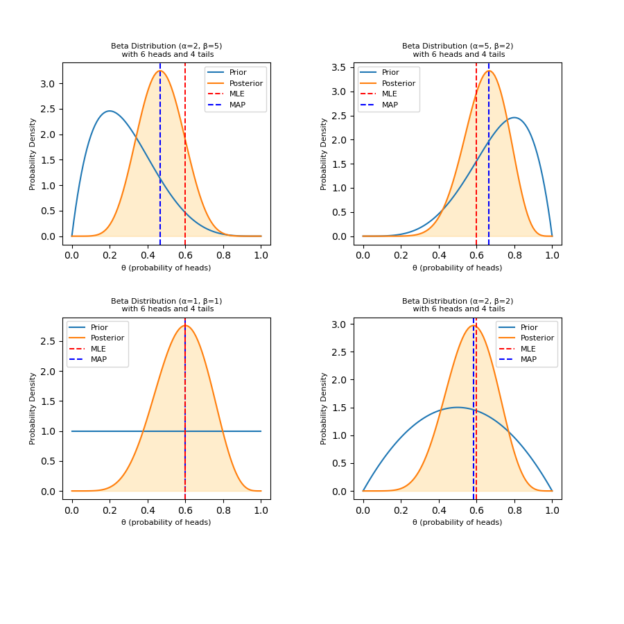

# Bayesian Statistics

This is the fifth assignment submission for CS203: Mathematics for Computer Science III submitted by Aditi Khandelia and Kushagra Srivastava.

## Description

The script uses the beta distribution as the conjugate prior for the binomial likelihood of the coin toss experiment. It calculates the posterior distribution for four different prior distributions:

1. Beta(2, 5)
2. Beta(5, 2)
3. Beta(1, 1)
4. Beta(2, 2)

For each prior, the script assumes that the coin was tossed 10 times, resulting in [H,H,H,T,T,T,H,H,H,T]

## Build Instructions

To use the script, simply run the Python file. The plots will be displayed in a new window.

```
python3 bayesian.py
```

## Dependencies

The script requires the following Python libraries:

- `numpy`
- `matplotlib.pyplot`
- `scipy.stats`

## Example Plots

Here are the four plots generated by the script, one for each prior distribution:



Each plot shows the prior distribution (blue), the posterior distribution (orange), the MLE (red dashed line), and the MAP estimate (green dashed line).
